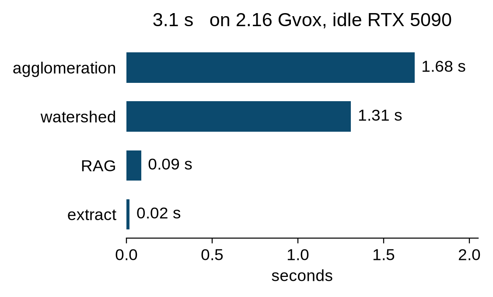

# gpu-waterz

GPU port of [`waterz`](https://github.com/funkey/waterz). Affinities in,
labels out. numpy or torch.

```
EM volume -> CNN affinities [3,Z,Y,X] -> gpu_waterz.segment -> uint32 labels
```

Most pipelines still run CPU waterz after the net. This keeps the decode
on the device.

Quality is the shipped CREMI-A val volume: uint8 affinities
`[3,125,1200,1200]` plus uint32 GT
([tarball](https://drive.google.com/file/d/1zbGpyr9M5Pvhgfy96V9erQwAeRZo23hW/view?usp=drive_link)).
VOI tracks stock waterz to +0.02 at 0.2, 0.3, 0.4, and 0.5 (split and
merge both). A second run is byte-identical. Speed is `scripts/make_big.py`'s
3x2x2 tile of that affinity (`[3,375,2400,2400]` = 2.16 Gvox) on an idle
RTX 5090: 3.1 s, ~13 GiB peak vs ~42 fused.



Same contact-mean merge as waterz. The heap order is approximated so it
can run in parallel. Mutex, Kruskal, GASP, and the rest on this graph miss
the VOI box: [voi_atlas.csv](data/cache/voi_atlas.csv). Algorithm:
[docs/decode.md](docs/decode.md).

## Install

```bash
uv sync
bash scripts/build_cuda.sh   # nvcc; writes src/libws_gpu.so librag_gpu.so libparhac_d.so
uv run python examples/torch_to_labels.py
```

`uv sync` is the Python package. The `.so` files are a separate nvcc step.
Missing libs raise `RuntimeError` pointing at `scripts/build_cuda.sh`.
Override the compiler with `WATERZ_NVCC`. Fatbin is `sm_86` (Ampere),
`sm_89` (Ada), `sm_120` (Blackwell), plus `sm_86` PTX for other cards.

```python
import numpy as np
import gpu_waterz as wz

aff = np.random.rand(3, 32, 64, 64).astype(np.float32)
labs = wz.segment(aff, [0.2, 0.3, 0.4, 0.5])  # list of uint32 [Z,Y,X]
```

```python
import torch, gpu_waterz as wz
aff = torch.rand(3, 32, 64, 64, device="cuda")
labs = wz.segment_d(aff, [0.3], return_device=True)  # CUDA torch tensors
```

## API

Thresholds are **affinity** (merge while contact-mean > T). Stock waterz
heaps on **score** `~ 1 - affinity`. Convert explicitly:

```python
wz.segment(aff, [0.8, 0.7, 0.6, 0.5], threshold_mode="score")
# same as affinity 0.2, 0.3, 0.4, 0.5
```

| Function | Role |
|---|---|
| `segment(aff, thresholds, *, threshold_mode="affinity", eps=None, ...)` | affinities to labels |
| `agglomerate(...)` | same as `segment` (list, not a waterz generator) |
| `labels_from_fragments(aff, frag, thresholds, ...)` | GPU merge of existing fragments; numpy in/out |
| `segment_d(..., return_device=True)` | device-resident; torch CUDA in stays on device |
| `fragments(aff)` | watershed only |
| `region_graph(aff, frag)` | contact-mean RAG arrays |
| `scores_to_affinity` / `affinity_to_scores` | unit conversion |
| `from_torch` / `to_torch` | torch helpers |
| `cuda_libs_ready()` | whether `src/lib*.so` exist |

`eps` sets ParHAC `(1+eps)`. `None` uses `WATERZ_AGG_EPS` or dual-eps:
**0.08** for several cuts, **0.40** for a single threshold of 0.3.
Raising past 0.40 fails merge VOI at 0.3.

Stock `waterz.agglomerate` is the full pipeline (our `segment`). LSD's
agglomerate worker is merge-from-fragments (`labels_from_fragments`).

## Quality (CREMI-A val `[3,125,1200,1200]`)

Files: `cremiA_val/{affinity,gt}.h5` in the
[dataset tarball](https://drive.google.com/file/d/1zbGpyr9M5Pvhgfy96V9erQwAeRZo23hW/view?usp=drive_link).
The tarball README: EM + GT are CREMI sample A, crop z 100:225 of the
training volume, xy 0:1200; affinities from the released CAD checkpoint
`CremiA.ckpt` (Liu et al., CVPR 2024). What we grade:
[docs/decode.md](docs/decode.md).

VOI split **and** VOI merge each within +0.02 of stock waterz at affinity
0.2, 0.3, 0.4, 0.5. Run-to-run labels are byte-identical. Fragment IDs
need not match waterz; the partition is what is graded.

| aff | VOI split | limit | VOI merge | limit |
|-----|-----------|-------|-----------|-------|
| 0.2 | 0.3707 | 0.3979 | 0.3350 | 0.3525 |
| 0.3 | 0.4512 | 0.4738 | 0.2505 | 0.2611 |
| 0.4 | 0.5162 | 0.5378 | 0.2268 | 0.2381 |
| 0.5 | 0.6129 | 0.6309 | 0.2184 | 0.2293 |

Full table: [data/cache/voi_atlas.csv](data/cache/voi_atlas.csv).

## Speed (idle RTX 5090)

CUDA events, affinity already in VRAM, `[3,375,2400,2400]` = 2.16 Gvox,
affinity 0.3. Pin `data/cache/N19_I0_REPRO.json`.

| stage | ms |
|---|---|
| watershed | 1309 |
| RAG | 85 |
| agglomeration | 1680 |
| extract | 18 |
| end-to-end | 3093 (~0.70 Gvox/s) |

Four-threshold VOI: PASS. Two full runs, identical labels. Time only on an
idle GPU (a co-tenant moved one run 1634-5018 ms). Pin env and leftover
knobs: [docs/porting.md](docs/porting.md).

```
bash scripts/eval.sh          # four-T + identity on data/cremiA_val
bash scripts/eval.sh --216    # plus 2.16 Gvox timing if that HDF5 exists
```

## Docs

| File | What it is |
|---|---|
| [docs/usage.md](docs/usage.md) | pipeline call sites, stages, build, eval volumes |
| [docs/decode.md](docs/decode.md) | why this algorithm, VOI, knobs vs other clustering |
| [docs/porting.md](docs/porting.md) | other GPUs: build, VRAM, pin env, how to time |
| [docs/citations.md](docs/citations.md) | papers and code we used, with the conclusion |

Vendored waterz: `funkey/waterz` `a0184d2`. Measurements: driver 580, nvcc 12.8.

GPU time (idle RTX 5090): Viktor Toth ([@csiki](https://github.com/csiki)).
