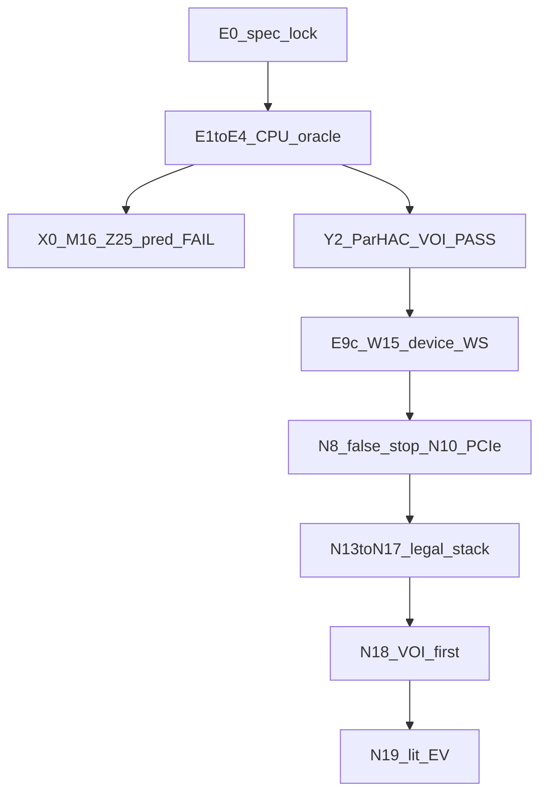

# GPU waterz campaign atlas

Affinity-flow watershed + contact-mean ParHAC on CREMI-A: what cleared the
VOI bar, what died, and measured stage times. Lab notebook: [LOG.md](LOG.md).
Pinned quotes: [SOURCES.md](../papers/SOURCES.md). Machine-readable negatives:
[voi_atlas.csv](../data/cache/voi_atlas.csv). Remaining problem: [PROBLEM.md](PROBLEM.md).
Dead stamps: [n19_dead.jsonl](../data/cache/n19_dead.jsonl). Historical
evaluation contract (for log cross-refs only): [TASK.md](../TASK.md).

**Measurement card for every speed number below:** idle **RTX 5090 32 GB**,
greengoblin, CUDA events, affinity already in VRAM unless a note says otherwise.
Do not treat 5090 throughput as portable across GPUs without remeasurement.
Identity vs `wz_fragments.npy` is diagnostic; four-threshold VOI is the quality bar.
Parks off on the timed path.

---

## Part I  -  Research report and log

### 1. Quality and throughput targets used in this campaign

GPU implementation of stock `waterz`: affinity-flow fragments **and** contact-mean agglomeration -> final uint32 labels. A bare over-segmentation is not the deliverable.

| Target | Number | Notes |
|---|---|---|
| Accuracy | VOI split **and** merge <= baseline+0.02 at aff **0.2, 0.3, 0.4, 0.5** on CREMI-A val `[3,125,1200,1200]` | matched stock waterz |
| Throughput (research stretch) | ~2 Gvox/s class on 2.16 Gvox @ T=0.3 | **not hit**; see Part III |
| Fit | stage peaks must fit ~24 GB class cards | z-slab path |
| Det | byte-identical labels run-to-run (waterz itself is not) | |

Reference cost: 6.7 Mvox/s single-thread CPU waterz; val 26.9 s; 2.16 WS+RAG alone 145 s. Thresholds in the API are **affinity**; waterz scores are `1-aff` ([THRESHOLD.md](THRESHOLD.md)).

Two facts that decided every later sprint ([PLAN.md](../PLAN.md) section 1; SOURCES S3, S17, S29):

1. **Mean affinity is not Kruskal.** Contact-area reweight after merge (`MeanAffinityProvider::addAffinity`). Frozen-weight MST / mutex / AbsMax are a different partition class.
2. **Exact average-linkage HAC is P-complete / CC-hard** (ParHAC 2022 Thm 1.2; Abboud et al. ICALP 2024). No poly-log exact MEAN. Approximate order is acceptable **if VOI holds**.

Vendored waterz: `funkey/waterz` commit `a0184d2` (SOURCES header).

### 2. Campaign chronology



#### Phase A  -  Spec and oracles (T0-E4)

Pin: LOG `## T0` ... `## E4`.

- Vendored `a0184d2`. Fragments **2 175 400**, RAG edges **7 505 458** exact vs TASK (LOG E0b / E3cpu).
- Reproduced `voi.csv` to ~1e-3 (wheel jitter; tarball README already says 4th-decimal drift). 1e-05 criterion not met; fragment/edge lock is exact.
- Exact S4 heap on those fragments PASSes VOI (E4). C++ heap port was +0.017 merge at 0.2 and was rejected.
- Threshold unit locked from shipped `baseline/run_baseline.py` (THRESHOLD.md).

#### Phase B  -  Partition-class massacre

Same cached RAG (`data/cache/rag.npz`), official grader. Not "we didn't tune k". Full rows: [voi_atlas.csv](../data/cache/voi_atlas.csv).

| Class | Probe | Typical fail mode | Pin |
|---|---|---|---|
| Frozen CC / waterfall | X0, W31 | merge VOI **7.55-7.78** (giant) | LOG `## X0`, `## W31` |
| Union-all-in-band | X1 B=16..1024 | T=0.2 merge still 0.50; T=0.3 near-miss at B=1024 | LOG `## X1` |
| Mutex / GASP AbsMax | M16, M16b hop-k | split **0.91 / 2.13** (under-merge) | LOG `## M16` |
| Kruskal SDSL | N12 | split 2.94, 0 merges | [N12_OFF.md](N12_OFF.md) |
| SDSL size-cap | Z25 all S0 | blocks giant **and** waterz large-large merges | LOG `## Z25` |
| FH MInt | F23 all k | cannot hit both VOI halves | LOG `## F23` |
| SRM | R24 all Q | giants + under-merge | LOG `## R24` |
| Soille alpha-omega | S26 all omega | T=0.2 giant or split fail | LOG `## S26` |
| Relative-contact / leftover | R32, L33, L36 | split or merge, never both | LOG `## R32` |
| TeraHAC SubgraphHAC | T14 | no first outer in 5-6 min (Y1-class) | LOG `## T14 KILLED` |
| RAMA signed multicut | N13 600 s, N19 60 s | timeout, no sol | [N13_RAMA.md](N13_RAMA.md), [N19_X3.md](N19_X3.md) |
| GASP Average | N19 X2 | split 0.155 / merge **7.55** | [N19_X2.md](N19_X2.md) / `N19_X2.json` |
| NNG filter | N19 H2 | 7.5M->1.8M edges; split **2.15** | `N19_H2.json` |
| Extra closed-plateau CCs | E1 GPU UF | nfrag +1.6%; merge FAIL | LOG `## E1 FAIL` |
| eps>=0.5 ParHAC | N12 | T=0.3 merge 0.271-0.87 | N12_OFF |
| eps in (0.41,0.49) | N18 B2 | **all nine** T=0.3 merge FAIL (0.265-0.291 vs 0.2611) | [N18_B2.md](N18_B2.md) |

#### Phase C  -  The accuracy lock that survived

Contact-mean **(1+eps) ParHAC**. Pins: LOG `## Y2 PASS`, `## E2`, `## E3`; SOURCES S29, S32.

- Y2 eps=0.01 four-T PASS (501 s, 8653 rounds). RAC also PASSes and is too serial (Y1, 12073 rounds).
- Paper-eps **0.08** is the largest value that still four-T PASSes; 0.09 fails at aff 0.2 (README / N18).
- Speed path T=0.3 alone allows eps=**0.40** (N2). Crossing 0.40 fails merge for every 0.01 step to 0.49 (N18 B2).
- Funke HistogramQuantile + BinQueue PASSes and is still serial O(n) (Q20 == E4 digits; SOURCES S16).
- Dual-path (eps=0.08 four-T / eps=0.40 single-T) is TASK-legal.

Locked four-T table (N16 deep, independent official regrade, [N16_DEEP.md](N16_DEEP.md)):

| aff | split | merge | limit_s | limit_m |
|-----|-------|-------|---------|---------|
| 0.2 | 0.370698 | 0.335006 | 0.3979 | 0.3525 |
| 0.3 | 0.451219 | 0.250531 | 0.4738 | 0.2611 |
| 0.4 | 0.516214 | 0.226759 | 0.5378 | 0.2381 |
| 0.5 | 0.61294 | 0.218363 | 0.6309 | 0.2293 |

Byte-identical table vs T7 and T15 regrades. N17 EMIT_HOLES does not change the partition (2.16 label sha identical to N16).

#### Phase D  -  Device watershed that matches S1

Host S1 plateau stayed the accuracy path until E9c/W15: GPU flow + corner BFS + basin UF, **nfrag=2175400, bg=506568, array_equal vs `wz_fragments.npy`** (LOG `## W15 PASS`). Extra closed plateaus are a VOI fail, not a speed trick (E1: nfrag 2 210 180, merge FAIL at 0.2/0.3/0.4). W5 list UF (Chen face domain) is the later WS kernel.

#### Phase E  -  Measurement failures (the real log)

These wasted more calendar time than any kernel.

1. **N8 "2.16 is linear, stop CUDA."** e2e 13518 ms / 0.160 Gvox/s ([N8_IMPOSSIBLE.md](N8_IMPOSSIBLE.md)). False: N9/N10 showed HOST_PARK + AFF_PARK were **pageable PCIe inside the timed window**. Parks off: e2e **4918 ms**, WS 6536->2577, RAG 424->**83** (the 6 GiB aff H2D had been booked as RAG). [N10_BOTTLENECK.md](N10_BOTTLENECK.md). N8 stop is void.
2. **Compact IOU (N7).** N0 credited compact -> 59 ms via E2 visit cut 3.86x. Measured GPU compact **227 ms, owner=hash (53%)**, scan 19% ([N7_STOP.md](N7_STOP.md)). Splice cannot deliver the credited factor.
3. **Identity vs TASK.** Waterz is not self-identical. N18/N19 `voi_only`: identity is diagnostic; four-T is the ship bar. A4 coarse changed basins (nfrag 3 136 975 vs 2 175 400) even when T=0.3 VOI looked OK (`n19_dead.jsonl` N18_A4).
4. **Empty nsys.** N18 dump empty without `--force-export`. N19 I0 fixed it ([N19_I0_NSYS.md](N19_I0_NSYS.md)). Without owners, W1/W3 would have been ground as Playne/hist noise (hook 84.5 ms, vcount 148 ms).
5. **Co-tenant / VLLM.** README historically: one workload 1634-5018 ms (3.1x). `card_busy` refuse + `n18_free_gpu.sh` became harness law. Never claim 5090 as 3090.
6. **Fused 2.16 WS peak ~42 GiB** (SOURCES S40 / `d1_mem.py`). Listing's "~9 GB leftover" is 24-15.1, not measured stage peaks. Z-slab N=3 (Z=125, aff=0 seams) is the fit path; 8-tile serial was 8.3x and is dead. SHARE_OFF is +4 B/vox  -  C++ defaults frozen until 3090 peak.

#### Phase F  -  Legal stack climb (N13->N17)

Parks off, env-gated levers, four-T before 2.16.

| Stack | 2.16 e2e (5090) | WS ms | agg ms | pin |
|---|---|---|---|---|
| N10 parks off | 4918 / 0.44 Gvox/s | 2577 | 2238 | N10_BOTTLENECK |
| N15 FOLD+SHARE_OFF+HOOK+FUSE_DIRTY | 3499 | 1313 | 2081 | [N15_STACK.md](N15_STACK.md) |
| N16 +NLIVE_ARITH | 3334 | 1312 | 1929 | [N16_DEEP.md](N16_DEEP.md) |
| **N17 +EMIT_HOLES** | **~3111 / 0.69 Gvox/s** | **1315** | **1690** | [N17_DEEP.md](N17_DEEP.md) |
| N18 A1 / N19 I0_REPRO | **3093-3104 / 0.70** | 1309-1315 | 1680-1683 | [N18_A1.md](N18_A1.md), `N19_I0_REPRO.json` |

N17 two-run 8 GiB label sha256 `c53d430e5ba7f2dbbb8b011d93b8de6a3e98f34276ab5f8e5afcd0c23eced937` (identical to N16). nlab T=0.3 = **3 860 788**. WS peak **13.22 GiB**.

Env (legal floor, all getenv; C++ product defaults still 0):

```
WATERZ_UF_ALGO=3 HOST_PARK=0 AFF_PARK=0 AGG_LEVERS=15
WATERZ_FOLD_FLATTEN=1 SHARE_OFF=1 HOOK_ROOT=1 FUSE_DIRTY=1 NLIVE_ARITH=1 EMIT_HOLES=1
```

eps=0.40 on the T=0.3 speed path; eps=0.08 on four-T.

#### Phase G  -  N18 VOI-first

[N18_SUMMARY.md](N18_SUMMARY.md). A2-A5 no WS<=900 with four-T. B1 parallel BinQueue wall 2253 + VOI FAIL. B2 eps grid dead. B3 COMPACT_EVERY=8 **slower** (agg 1765 vs 1690). ParHAC local max ~1690 ms agg.

#### Phase H  -  N19 literature EV

[N19_SUMMARY.md](N19_SUMMARY.md). Owners known (`n19_owners.json`, 40 kernels). W1/W3 skipped (owner <200 ms). W2 skip (no flag/scan >=200). H1 bin-ladder 5841 ms + VOI FAIL. H2 NNG VOI FAIL. H3 RNN stamped unimplemented (honest; not a silent skip). H4 simplified freeze != ParHAC parents (321856 vs 309455 roots). X1-X3 stamped, no 2.16 on FAIL. C REFUSE on 5090.

### 3. Best measured state (2026-09-09)

Official 2.16 @ T=0.3, idle 5090, CUDA events, aff in VRAM. Pin: `data/cache/N19_I0_REPRO.json`.

- e2e **3093.43 ms ~ 0.698 Gvox/s** (N18 A1 was 3104.09 ms; within +/-2%)
- WS **1309.3 ms**, RAG **85.4 ms**, agg **1679.9 ms**, extract **18.3 ms**
- four-T **PASS** (513 ms on cached RAG); T=0.3 VOI split 0.4408 / merge 0.2543 (limits 0.4738 / 0.2611)
- identity diagnostic True (`fp=fff9037cab341692be0c9bf3c577d4ff`, nfrag=2175400, bg=506568)
- nfrag 2.16 = **26 104 800** = 12 x val (make_big 3x2x2; N8)
- Need **~2.9x** on this 5090 to 1080 ms; bw-scaled 1792/1008 ~ **~5x** if the pipeline is bandwidth-bound on 3090 Ti
- **WS alone (1310 ms) already exceeds the 1080 ms TASK budget**

Owner map (N19 force-export, [N19_I0_NSYS.md](N19_I0_NSYS.md) / `n19_owners.json`):

| kernel | total_ms | % of kernel time | role |
|---|---|---|---|
| `k_w5_compress_list` | 508.0 | 18.5 | WS list-UF compress |
| `:hash_rewrite` | 286.9 | 14.9 | ParHAC hash rewrite (438 launches) |
| `k_rebuild_active` | 278.4 | 10.1 | ParHAC rebuild (438) |
| `k_rewrite_dirty_fuse` | 273.0 | 9.9 | dirty fuse (438) |
| `k_hash_insert` | 173.6 | 6.3 | hash insert |
| `k_hash_emit_holes` | 161.1 | 5.9 | EMIT_HOLES |
| `k_count_v2` | 148.1 | 5.4 | vcount  -  below 200 ms kill |
| `k_propose_listed` | 146.8 | 5.3 | propose |
| `k_w5_hook_list` | 84.5+82.1 | ~6 | hook  -  below 200 ms kill |
| CUB radix onesweep | 31.6 | 1.1 | sort  -  below 200 ms kill |

NVTX: `w5_stitch` 835 ms (range, not a single kernel), BFS/`k_indep_bfs` ~14 ms of 2.16 WS.

Optimistic kill of compress_list->0 and hash+rebuild+rewrite->0: WS~800 + RAG 86 + agg~840 + extract 19 ~ **1745 ms**, still ~1.6x over 1080 **on the faster card**. That is why N19 W/H stop is not laziness.

### 4. Error checklist (already paid for)

Never: nsys-only kill when a GPU lever exists; 2.16 before four-T; mapped host atomics; nfrag/bg as partition; 5090 Gvox/s as 3090; C++ default flip without 24 GB peak; unbounded kernels; `set -e` aborting expected kills; stale `n8_216.json` after OOM; ignore `card_busy`; stack unmeasured levers; reopen [n19_dead.jsonl](../data/cache/n19_dead.jsonl); grayscale PRUF as S1; Playne-as-park-theorem; serial or N18 parallel BinQueue; eps in (0.41,0.49) speed path.

### 5. Dead registry (human)

Seeded from N18 + N19 stamps. Do not reopen. Full JSONL: [n19_dead.jsonl](../data/cache/n19_dead.jsonl).

| exp_id | reason |
|---|---|
| WS_fold_no_SHARE_OFF | wrong basins 89% ndiff |
| WS_PIN_CHANGED | WS~1e6 ms mapped host atomics |
| WS_STITCH_ARENA | 1.00x + leak |
| WS_SORT_PACK | slower |
| WS_JUMP_FLATTEN / WS_LIST_HALVING | exhausted |
| WS_drop_k_count_v2 | BFS qsz corrupt |
| WS_Z_SLAB_0_fused | OOM |
| WS_Playne_park_era | park-era theorem |
| WS_PRUF_grayscale_S1 | Meyer != waterz S1 |
| AGG_sticky_sz0 | T=0.2 merge 0.3585>0.3525 |
| AGG_serial_BinQueue | hang >180 s |
| AGG_cuda_graph_G2 | killed |
| AGG_FUSE_PACK / DIRTY_UNMARK closer | noise |
| AGG_eps_ge_0.5 | four-T FAIL merge |
| AGG_eps_0.41_to_0.49 | all T=0.3 merge FAIL |
| AGG_N18_parallel_BinQueue | wall 2253 + VOI FAIL |
| AGG_MAX_OUTER_32 / compact_every / HASH_INSERT_ONLY / E6t default | killed |
| AGG_mutex_Kruskal_X1_SubgraphHAC_RAMA | task_legal=False class |
| AGG_cpp_defaults_pre_3090_peak | policy |
| N18_A2-A5 | no WS<=900 with four-T + timed 2.16 |
| N18_B3 | COMPACT_EVERY=8 slower |
| N19_W1 / W3 | owner <200 ms |
| N19_H1 | wall 5841>800 |
| N19_H2 | NNG VOI FAIL split 2.15 |
| N19_H3 | BATCH_RNN not implemented |
| N19_H4 | parents != ParHAC |
| N19_X1 | no affinity-PRUF; grayscale S1 dead |
| N19_X2 | GASP Average VOI FAIL |
| N19_X3 | RAMA 60 s timeout |

---

## Part II  -  Contributions and findings

Capture failure is the current risk: until this file, the work lived in a 3600-line LOG. Ranked by gap type (fracture framework).

### Finding 1  -  Type E: the speed problem was (partly) PCIe and bookkeeping

N8's "impossible" 0.16 Gvox/s was HOST_PARK + AFF_PARK + booking aff H2D as RAG. Parks off doubled throughput without changing the partition (4918 ms, 0.44 Gvox/s). Community value: **any GPU connectomics timing that D2H's the affinity or parks hundreds of millions of indices through the CPU is not a watershed result.**

### Finding 2  -  Type D: algorithm-class x VOI atlas on the waterz RAG

Same 7.5 M-edge CREMI-A contact-mean RAG, same shipped grader, four thresholds, both VOI halves. Frozen CC / mutex / Kruskal / FH / SRM / Soille / TeraHAC-control-flow / RAMA / GASP Average / NNG / extra-plateau-CC fail in **structurally different** ways (giant vs under-merge vs timeout vs order-change). This table does not exist in Wolf, Bailoni, Dhulipala, or Funke. Cite [voi_atlas.csv](../data/cache/voi_atlas.csv).

### Finding 3  -  Type C: (1+eps) contact-mean ParHAC is the only parallel class that four-T PASSed

eps=0.08 four-T / eps=0.40 T=0.3 is an empirical phase boundary, not a hyperparameter. Crossing 0.40 at T=0.3 fails merge for **every** 0.01 step to 0.49. GPU port of paper ParHAC (matching + S3 contract + dual path) with four-T PASS and byte-identical 2.16 labels is, as of the SOURCES sweep (`arXiv all:ParHAC AND all:GPU` = 0 on 2026-09-06; S42), the first public CUDA ParHAC-like agglomerator on this statistic.

### Finding 4  -  Type A applied (not proved here): exact MEAN will not close the bounty

Abboud/ParHAC theorems already say exact average-linkage has no poly-log parallel algorithm under standard assumptions (SOURCES S17, S29). N19 H1-H4 are the engineering corroboration: bin-ladder slower+VOI-fail; NNG changes merge order; simplified Lu freeze != dendrogram; RNN not even implemented. Scope: this does **not** prove 2 Gvox/s is impossible  -  TASK allows approximate order. It proves **exact-heap GPU** is the wrong closer.

### Finding 5  -  Type E: plateau grouping, not BFS, owns watershed

BFS is **~14 ms** of 2.16 WS (`k_indep_bfs`). `k_w5_compress_list` is **508 ms**. N9 killed Playne/halving because they cannot close 12x; they were aimed at the 5 ms BFS. Extra closed-plateau CCs fail VOI (E1). **S1 plateau semantics are load-bearing; the BFS rewrite is not the timed owner.**

### Finding 6  -  Type D: memory is stage-maxima, not 15.1+scratch

Measured: WS fused pred ~42 GiB at 2.16; after lifetime cuts + z-slab, legal stack WS peak **13.22 GiB** (N17_DEEP). Listing leftover math is not a fit theorem. Buffer sharing saved **21.95 GiB** of double-counting (README memory table, still valid as an accounting). 3090 24 GB still **unmeasured**. SHARE_OFF is +4 B/vox; do not flip C++ defaults.

### Finding 7  -  Methodology (reusable lab infrastructure)

`voi_only` vs `ident`; four-T before 2.16; owner >=200 ms; `n19_dead.jsonl`; `card_busy` refuse; subprocess-per-env; abort stamps; claim string "not a 2 Gvox/s number; not 3090 Ti". This is how the negative results stayed honest.

One-command four-T + identity diagnostic (no 2.16):

```
.venv/bin/python -u scripts/n19_voi_gate.py --mode voi_only --no-216 --name LEGAL_FOUR
```

Official shipped grader (writes `mine_thr*.h5`): `scripts/eval.sh` / `scripts/legal_eval.sh`.

### What is not a contribution

- Hitting 2 Gvox/s (not done; not 3090).
- "GPU waterz is 100x CPU" without card/volume/gates.
- Playne / Allegretti / NNG / bin-ladder as speed wins (skipped or VOI-dead).
- README's pre-N17 wording that agglomeration "is ParHAC eps=0.01" as the product (Y2 lock is historical; the legal stack is dual-eps 0.08/0.40).

---

## Part III  -  Honest ceiling and what not to grind

Best e2e **~0.70 Gvox/s on a 5090**. WS floor ~1310 ms > 1080 ms TASK budget. Remaining owners (compress_list 508 + hash/rebuild/rewrite ~838) do not arithmetic to TASK even if zeroed. Track C script refuses unless the card is a real 3090 Ti.

Do not: N20 micro-opt on hook/vcount/sort; another eps grid; claiming 2 Gvox/s from 5090 arithmetic; grinding compress_list without a four-T identity plan; an academic paper that only says "we almost hit a bounty."

Do: cite the atlas; state the remaining problem in [PROBLEM.md](PROBLEM.md); run Track C if a 3090 Ti appears.
